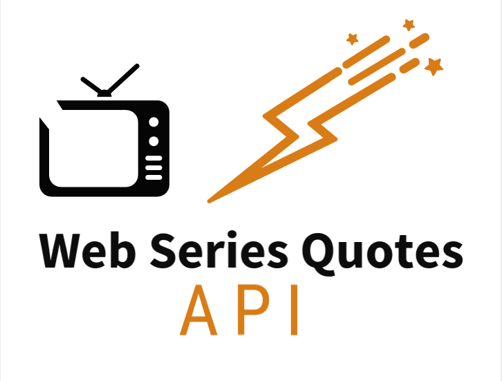

# Web-Series-Quotes-Api

Api for Quotes of various web-series. Api automatically generate quotes with background image. Api also returns the Quotes and its author as json.

## Available Web-Series

- [Breaking Bad](https://web-series-quotes.herokuapp.com/breakingbad)
- [Dark](https://web-series-quotes.herokuapp.com/dark)
- [Game Of Thrones](https://web-series-quotes.herokuapp.com/gameofthrones)
- [Money Heist](https://web-series-quotes.herokuapp.com/moneyheist)

## URI

```url
https://web-series-quotes.herokuapp.com
```

## Generating Quotes with images

There are four method to Generate Quotes

- Generating Quotes with in-build images
- Generating Quotes with your own images
- Generating Quotes with blank colored Background
- Generating Quaotes of your own quote and own image

### Generating Quotes with in-build images

Presently there is four images are in build
| **Name of images** |
| ------------------ |
| breakingbad        |
| dark               |
| moneyheist         |
| gameofthrones      |

```url
/generate/{series_name}/{quote_id}/image?src={name_of_image}&size={font_size}&color={font_color}
```

#### Example

```url
https://web-series-quotes.herokuapp.com/generate/breakingbad/1/image?src=breakingbad&size=150&color=pink
```


### Generating Quotes with your own images

```url
/generate/{series_name}/{quote_id}/image?src={url_of_your_image}&color={font_color}&size={font_size}
```

#### Example

```url
https://web-series-quotes.herokuapp.com/generate/moneyheist/5/image?src=https://www.gstatic.com/webp/gallery/3.png&color=yellow&size=100
```


### Generating Quotes with blank colored Background

```url
/generate/{series_name}/{quote_id}/blank?fore={foreground}&back={background}&size={font_size}
```

#### Example

```url
https://web-series-quotes.herokuapp.com/generate/breakingbad/10/blank?fore=red&back=yellow&size=300
```


### Generating Quote of your own quote and image

```url
/generate/image?src={url_of_image}&color={font_color}&size={font_size}&text={your_text}
```

#### Example

```url
https://web-series-quotes.herokuapp.com/generate/image?src=https://www.gstatic.com/webp/gallery/1.png&color=yellow&size=100&text=Hello+world
```

```url
https://web-series-quotes.herokuapp.com/generate/blank?text=Hello+I'am+Python
```


## API

- [Get all Quotes](https://github.com/yogeshwaran01/web-series-quotes/blob/main/docs/all_quote.md)
- [Get Random Quotes](https://github.com/yogeshwaran01/web-series-quotes/blob/main/docs/random_quote.md)
- [Get Quotes by Id](https://github.com/yogeshwaran01/web-series-quotes/blob/main/docs/quote_by_id.md)

### Contributing

- Add other your favourite webseries quotes in ```data``` folder
- Add route path in ```routes.py```
- Make PR
